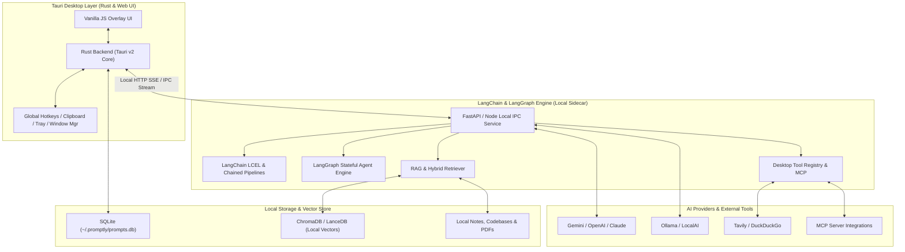
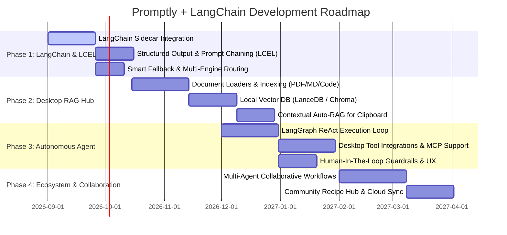

# Promptly — Product & Technical Roadmap

> **Lộ trình Phát triển & Kiến trúc Mở rộng với Hệ sinh thái LangChain & Autonomous Agent**

---

## 🎯 1. Tầm nhìn Sản phẩm (Vision)

**Promptly** được định hướng phát triển từ một công cụ *Desktop AI Overlay* đơn giản thành một **Universal Autonomous AI Co-pilot & Personal Knowledge Hub**:
- **Cực nhanh & Tiện lợi**: Phím tắt toàn cục (`Alt+Space`), giao diện nổi nhẹ nhàng, nắm bắt tức thì nội dung clipboard và ngữ cảnh làm việc.
- **Sức mạnh từ LangChain & LangGraph**: Tự động hóa quy trình phức tạp thông qua Prompt Chaining (LCEL), hệ thống nhớ dài hạn (Memory), truy xuất tài liệu cục bộ (RAG), và vòng lặp thực thi tác tử tự trị (Autonomous Agent Loop).
- **Quyền riêng tư & Bảo mật (Privacy-First)**: Lưu trữ cục bộ toàn bộ lịch sử, vector database và dữ liệu cá nhân trên máy của người dùng.

---

## 🏗️ 2. Kiến trúc Hệ thống Mở rộng (Hybrid Tauri + LangChain Sidecar)

---

## 🗺️ 3. Lộ trình Phát triển Chi tiết (Phased Roadmap)

---

### 🚀 Giai đoạn 1: Nền tảng LangChain & Chained Recipes (v1.5)
> **Mục tiêu**: Tích hợp LangChain engine, mở rộng từ các Recipe đơn lẻ thành chuỗi xử lý đa bước linh hoạt (LCEL).

- [ ] **LangChain Sidecar Integration**:
  - Đóng gói service LangChain/LangGraph chạy cục bộ, giao tiếp với Tauri Rust qua HTTP SSE / IPC.
  - Tự động quản lý vòng đời (khởi động/tắt) của Sidecar theo ứng dụng Tauri.
- [ ] **Chained Recipes & LCEL Pipelines**:
  - Hỗ trợ tạo Recipe gồm nhiều bước tuần tự (Ví dụ: `Bóc tách lỗi` ➔ `Giải thích nguyên nhân` ➔ `Tạo Unit Test` ➔ `Tạo Pull Request Draft`).
- [ ] **Structured Output Parsers**:
  - Tích hợp Pydantic / Zod Output Parsers để đảm bảo kết quả trả về đúng định dạng JSON Schema, bảng biểu hoặc Markdown chuẩn.
- [ ] **Smart Fallback & Load Balancing**:
  - Tự động chuyển đổi sang Provider/Model dự phòng (Gemini $\leftrightarrow$ OpenAI $\leftrightarrow$ Claude $\leftrightarrow$ Ollama) khi gặp lỗi Rate Limit, Quota hoặc mất mạng.

---

### 📚 Giai đoạn 2: Desktop RAG & Personal Knowledge Base (v2.0)
> **Mục tiêu**: Biến Promptly thành cổng tra cứu kiến thức cá nhân siêu tốc từ tài liệu và mã nguồn trên máy.

- [ ] **Local Document Ingestion**:
  - Hỗ trợ chọn thư mục tài liệu (Markdown, Obsidian Vault, PDF, Word, Codebase) để băm nhỏ (chunking) và đánh chỉ mục vector.
- [ ] **Embedded Local Vector Database**:
  - Nhúng **LanceDB** hoặc **ChromaDB** chạy 100% offline trên máy, không gửi dữ liệu nhạy cảm ra ngoài.
- [ ] **Contextual Auto-RAG cho Clipboard**:
  - Tự động trích xuất các đoạn tài liệu / code liên quan nhất đến nội dung clipboard để nạp vào prompt cho LLM.
- [ ] **Hybrid Search**:
  - Kết hợp Keyword Search (BM25) và Semantic Vector Search để đạt độ chính xác cao nhất khi tra cứu code và thuật ngữ chuyên ngành.

---

### 🤖 Giai đoạn 3: Autonomous Agent & Desktop Tool Calling (v2.5)
> **Mục tiêu**: Nâng cấp AI từ "người tư vấn" thành "người thực thi công việc" với khả năng tương tác với hệ điều hành và môi trường phát triển.

- [ ] **LangGraph Multi-Step State Machine**:
  - Triển khai ReAct / Plan-and-Solve Agent Loop với khả năng tự lập kế hoạch, sửa sai và thử lại khi gặp lỗi.
- [ ] **Native Desktop Tools**:
  - **Terminal / Shell Execution**: Chạy lệnh build, test, git commit (có kiểm soát an toàn).
  - **Filesystem Tools**: Đọc, tạo mới, và tự động sửa nhiều file trong workspace.
  - **Live Web Search**: Tích hợp Tavily / DuckDuckGo để tra cứu thông tin và tài liệu API mới nhất.
- [ ] **Hỗ trợ Model Context Protocol (MCP)**:
  - Cung cấp khả năng kết nối dễ dàng với các MCP Server ngoài (GitHub, Linear, Slack, PostgreSQL, Notion).
- [ ] **Human-in-the-Loop Guardrails**:
  - Giao diện xác nhận trực quan (Approval Modal) trước khi Agent thực hiện các thao tác quan trọng (chạy lệnh hệ thống, ghi đè file).

---

### 🌐 Giai đoạn 4: Multi-Agent Collaboration & Hệ sinh thái Cộng đồng (v3.0)
> **Mục tiêu**: Mạng lưới nhiều AI chuyên biệt phối hợp làm việc và mở rộng hệ sinh thái chia sẻ quy trình làm việc.

- [ ] **Team of Specialized Agents**:
  - Phối hợp giữa các Agent chuyên biệt: *Architect $\leftrightarrow$ Coder $\leftrightarrow$ Tester $\leftrightarrow$ Code Reviewer*.
- [ ] **Community Recipe & Pipeline Hub**:
  - Kho lưu trữ trực tuyến cho phép tải về và chia sẻ các Recipe Pipelines, Agents và Prompts tùy biến.
- [ ] **Cross-Device Private Sync**:
  - Đồng bộ an toàn cấu hình, công thức và lịch sử qua GitHub Gist hoặc Google Drive / iCloud có mã hóa đầu-cuối.

---

## 📊 4. Ma trận Phân loại & Mức độ Ưu tiên (Prioritization Matrix)

| Tính năng | Tác động (Impact) | Độ phức tạp (Complexity) | Ưu tiên | Phiên bản |
|---|---|---|---|---|
| **LangChain Sidecar Setup** | 🔥 Rất Cao | 🟡 Trung bình | **P0** | v1.5 |
| **LCEL Prompt Chaining & Pipelines** | 🔥 Rất Cao | 🟡 Trung bình | **P0** | v1.5 |
| **Structured Output Parsing** | 🟡 Trung bình | 🟢 Thấp | **P1** | v1.5 |
| **Local Vector DB & Document Ingestion** | 🔥 Rất Cao | 🔴 Cao | **P0** | v2.0 |
| **Contextual Auto-RAG for Clipboard** | 🔥 Rất Cao | 🟡 Trung bình | **P1** | v2.0 |
| **LangGraph ReAct Loop & Desktop Tools** | 🔥 Rất Cao | 🔴 Cao | **P0** | v2.5 |
| **MCP (Model Context Protocol) Support** | 🟡 Trung bình | 🟡 Trung bình | **P1** | v2.5 |
| **Human-In-The-Loop Approval UX** | 🔥 Rất Cao | 🟢 Thấp | **P0** | v2.5 |
| **Multi-Agent Teams (Hierarchical)** | 🟡 Trung bình | 🔴 Rất Cao | **P2** | v3.0 |
| **Community Recipe Hub & Cloud Sync** | 🟡 Trung bình | 🟡 Trung bình | **P2** | v3.0 |

---

## 🛠️ 5. Các Bước Kỹ thuật Cần Triển khai Ngay (Action Items)

1. **Tạo cấu trúc Sidecar Service**: Thiết lập thư mục `sidecar/` (Node.js/TS hoặc Python FastAPI) chứa LangChain core.
2. **Cập nhật Cấu hình Tauri**: Khai báo `externalBin` trong [tauri.conf.json](file:///Users/nals_macbook_129/Work_Space/Learning/prompt-builder-agent/src-tauri/tauri.conf.json) để quản lý tiến trình chạy nền.
3. **Triển khai PoC Chained Recipe**: Viết 1 chuỗi xử lý mẫu (Ví dụ: `review-pr` đa bước) chạy qua LangChain và stream token về giao diện UI qua SSE.
